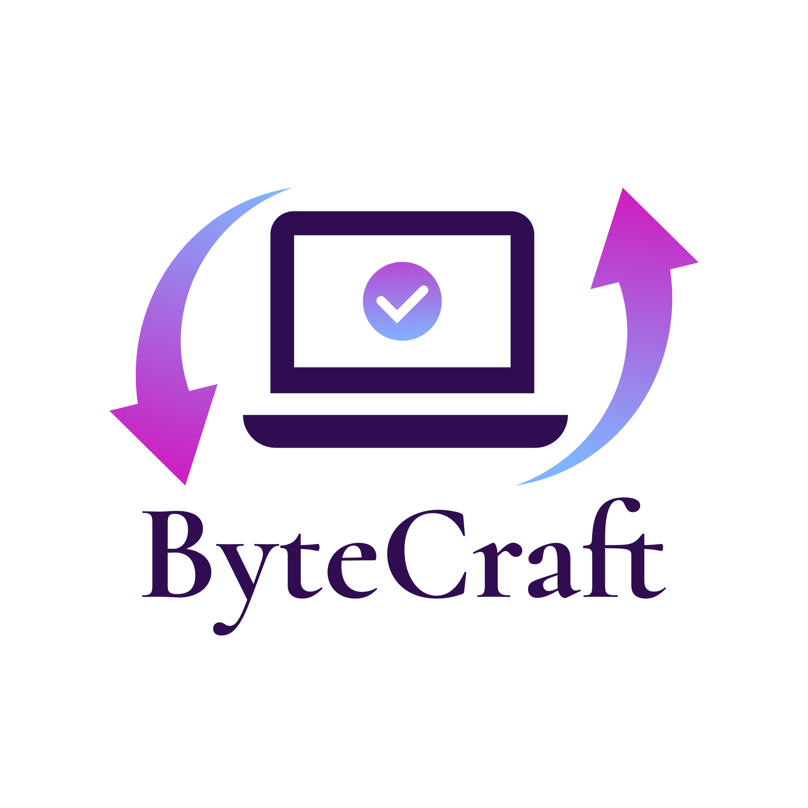

<!-- # ByteCraft
## features 

- [1] Syntax Highlighting:
Add syntax highlighting for different types of data (e.g., ASCII characters, numeric values).
- [2] Navigation:
Implement features like scrolling, jumping to specific offsets, or navigating through different sections of the file.
- [3] Color Themes:
Implement different color themes for the editor to provide a personalized user experience.
- [4] Byte Information:
Display additional information about the selected byte, such as its binary representation or numeric value.
- [5] Error Handling:
Implement proper error handling and inform users if there are issues with their input.
- [6] Character Encoding Support:
Allow users to choose different character encodings for input and output.
- [**aditional step**] Search and Replace:
Allow users to search for specific hex patterns and replace them.
- [**aditional step**] Real-time Collaboration:
If the editor is used in a collaborative environment, consider adding real-time collaboration features using technologies like WebSocket.
- [**aditional step**] Performance Optimization:
Optimize the code for better performance, especially if dealing with large files.
- [**not must do it**] Undo/Redo:
Include undo and redo functionality for user edits.
- [**not must do it**] File Upload :Allow users to upload binary files for editing.

can customize it according to the specific details of your project: -->

# ByteCraft
<!-- logo -->
<p align="center">
  
</p>

Online Hex Viewer is a web-based tool that allows users to upload files and view their hexadecimal and ASCII representations. It's built using Node.js, Express, and Pug.

## Features

- Upload and view the hexadecimal and ASCII representations of files.
- Supports various file types, including text files, images, and PDFs.

## Getting Started

### Prerequisites

- Node.js installed on your machine

### Installation

1. Clone the repository:

   ```bash
   git clone https://github.com/Eve-SatOrU/ByteCraft.git
2. Navigate to the project directory:
    ```
    cd bytecraft
    ```
3. Install dependencies:

    ```
    npm install
    ```
## Usage
1. Start the application:
    
    ```
    npm start
    ```
2. Open your browser and go to http://localhost:3000.

3. Upload a file using the provided form and view its hexadecimal and ASCII representations.

## Project Structure
* views/: Pug templates for the views.
* public/: Static files (CSS, images, JavaScript).
* routes/: Express route handlers.
* app.js: Main application file.
* controllers/: Controllers for handling file uploads and errors.
## Dependencies
Express: Web application framework for Node.js.
Pug: Template engine for Node.js.
Multer: Middleware for handling multipart/form-data, used for file uploads.
## Contributing
If you'd like to contribute to this project, please follow these guidelines:

Fork the repository.
1. Create a new branch for your feature or bug fix.
2. Make your changes and submit a pull request.
## License
This project is licensed under the MIT License.
